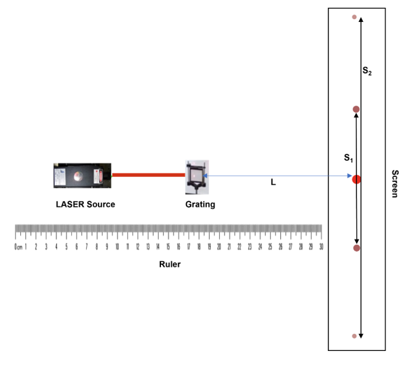
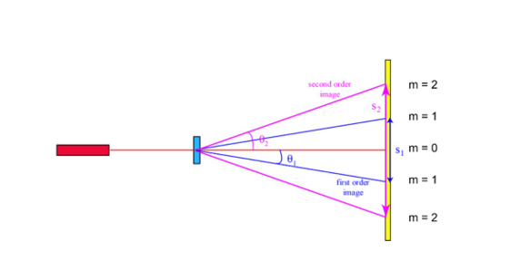
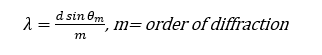
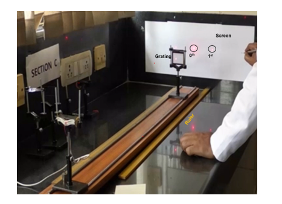
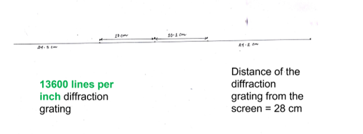
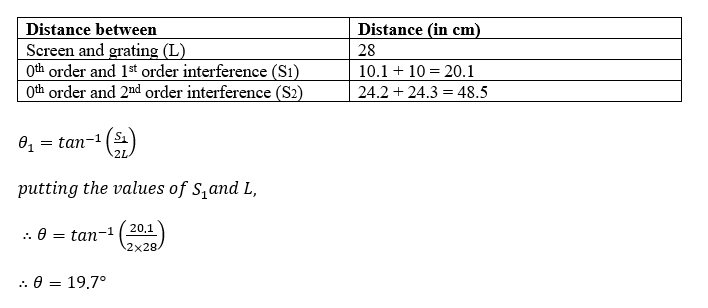
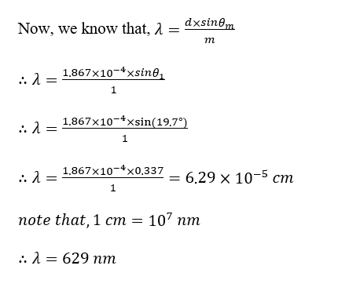

<b> Procedure to run the simulation : </b> 

1. Click on Laser Source button to add the laser in the experimental setup. 
2. Click on Grating button to place the diffraction grating between laser and screen. 
3. Click on Screen button to add the observation screen. 
4. After adding Laser, Grating, and Screen, click on Turn On to start the simulation. 
5. A diffraction pattern consisting of a central maximum and higher order maxima appears on the screen. 
6. Adjust the distance between the screen and grating using the slider provided. 
7. Note the distances between the central (0th order) maximum and S₁ (first order) and S₂ (second order) maxima. 
8. Click on Add Observation to record the readings in the observation table. 
9. Change the distance and repeat the above steps to take multiple readings.  

<b> Laboratory Procedure : </b>  
<b> Apparatus : </b> 
A.	LASER source 
B.	Grating 
C.	Ruler 
D.	Screen  

<b> Procedure in laboratory (diagram) : </b> 

<b>A. Measuring the distance between  : </b> 
1.	screen and grating (L)  
2.	0th order and 1st order interference (S1) and 
0th order and 2nd order interference (S2)  

 

<b>B. Determine the wavelength of the LASER using diffraction equation : </b> 
<b>1. determination of the angle </b> 
  

<b>2. determination of the wavelength </b> 
  

<b> Procedure in laboratory : </b> 
  

<b> Data and the analysis : </b> 
 
 

Given, the grating has 13600 lines per inch (grating constant). 
That means distance between two consecutive lines (d) = (1 ÷ 13600) = 7.35×10-5 inch 

note that, 1 inch= 2.54 cm	 
∴ spacing of the grating (d) = 7.353482 × 10-5 × 2.54 cm = 1.867784 × 10-4cm  

  

<b> Analysis : </b> 
A.	Determine the distance between the grating and the screen.  
B.	Note down the distance between the zeroth order interference pattern with the First and second order interference pattern. 
C.	Calculate the value of wavelength of the LASER using diffraction law.  

