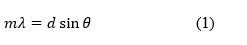
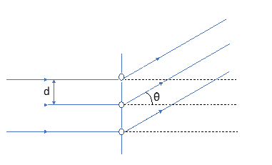
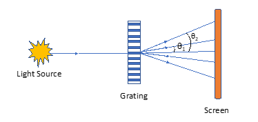
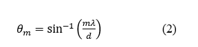

The diffraction of classical waves refers to the phenomenon wherein the waves encounter an obstacle that fragments the wave 
into components that interfere with one another. Interference simply means that the wavefronts add together to make a new wave which 
can be significantly different than the original wave. Here we will be using the diffraction grating that gives rise to the diffraction 
phenomenon. It consists of a transparent material into which a very large number of uniformly spaced wires have been embedded (Fig. 1). 
As the light impinges on the grating, the light waves that fall between the wires propagate straight on through. At certain points in the 
forward direction the light passing through the spaces (or slits) in between the wires will be in phase and will constructively interfere. 
Whenever the difference in path length between the light passing through different slits is an integral number of wavelengths of the incident 
light, the light from each of these slits will be in phase, and it will form an image at the specified location. Mathematically, the relation 
is simple: 

<!-- -->
mλ = d sinθ

 
<b>Figure 1.</b> Geometry determining the conditions for diffraction from a multi-wire grating. 

 
<b>Figure 2.</b> Experimental set-up for measuring wavelengths with a diffraction grating 

In the above equation, d is the distance between adjacent slits (which is the same is the distance between adjacent wires) (Fig. 1),
θ is the angle the re-created image makes with the normal to the grating surface, λ is the wavelength of the light, and 
m = 0, 1, 2, . . . is an integer. 

By shining a light beam into a grating whose spacing (d) is known, and measuring the angle θ where the light is imaged, one can measure the 
wavelength λ. Consider Fig. 2, which shows the set-up for a diffraction grating experiment. If a monochromatic light source shines on the grating,
images of the light will appear at several angles—θ1, θ2, θ3 and so on. The value of θm is given by the grating equation shown above, so that  

θm = sin-1(mλ/d)
<!-- -->

The image created at θm is called the mth order image. The 0th order image is the light that shines straight through. 
Here we will be looking at the first and second order diffraction images of a laser and measuring its wavelength. 
